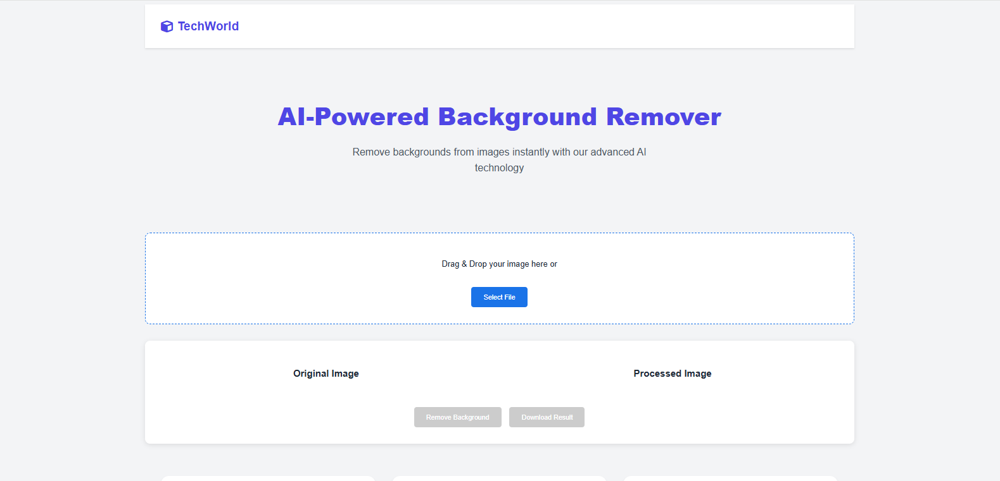
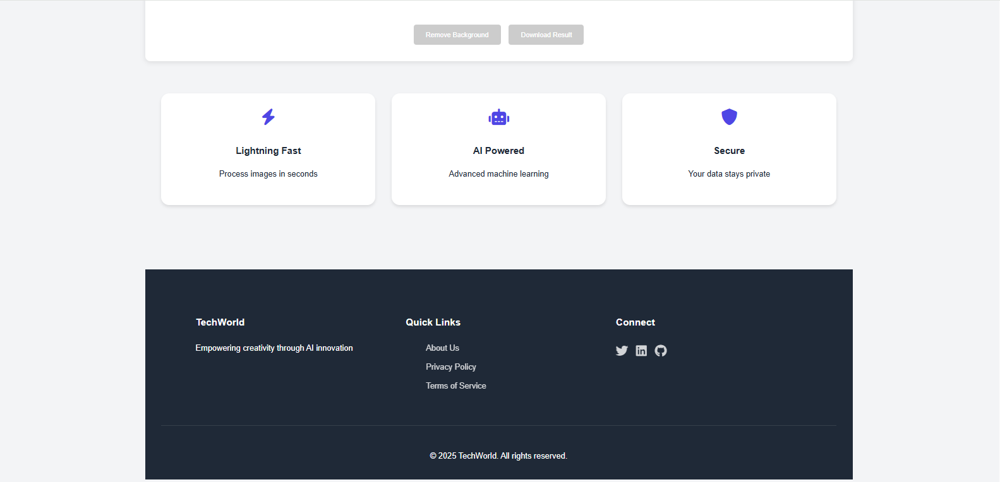
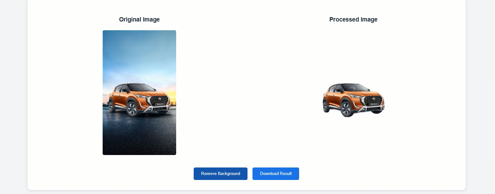

# AI Background Remover

An AI-powered web application that removes image backgrounds using a third-party AI API.

This project demonstrates real-world API integration, asynchronous programming, and advanced JavaScript concepts.

---

## 🚀 Features
- Drag & Drop image upload
- File selection upload
- Real-time image preview
- Background removal using AI
- Download processed image
- Loading state handling
- Error handling

---

## 🖼 Screenshot

*Example of the application after background removal.*

---

## 🛠 Tech Stack
- HTML5
- CSS3
- JavaScript (ES6+)
- Fetch API
- FileReader API
- FormData
- Slazzer AI API

---

## ⚙️ How to Run Locally
1. Clone the repository
2. Add your Slazzer API key inside `script.js`
3. Open `index.html` in your browser

⚠️ Note: Do not expose your API key publicly.

---

## 📈 Future Improvements
- Backend integration to hide API key
- Image size validation
- Progress bar animation
- Multiple image support
- Deploy live version

---

## 💡 What I Learned
- Working with external APIs
- Handling binary image data (Blob)
- Managing UI states during async operations
- Building user-friendly drag-and-drop interfaces
